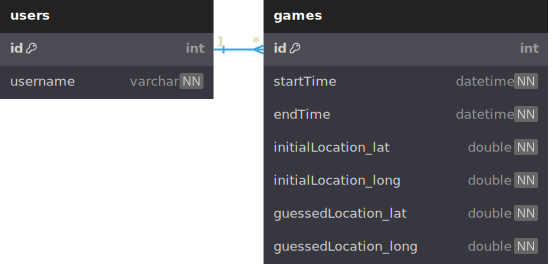

### Database Description:

The database consists of two tables: `users` and `games`.

#### Table `users`:

- `id`: An integer column and the primary key (pk) for the `users` table. It is set to auto-increment (increment), meaning each new record will automatically get a unique ID.
- `username`: A varchar (variable-length character) column that cannot be NULL. It stores the usernames of the users.

#### Table `games`:

- `id`: An integer column and the primary key (pk) for the `games` table. It is set to auto-increment (increment), ensuring each game record has a unique ID.
- `startTime`: A datetime column that cannot be NULL. It stores the start time of the game.
- `endTime`: A datetime column that cannot be NULL. It stores the end time of the game.
- `initialLocation_lat`: A double column that cannot be NULL. It stores the latitude of the initial location for the game.
- `initialLocation_long`: A double column that cannot be NULL. It stores the longitude of the initial location for the game.
- `guessedLocation_lat`: A double column that cannot be NULL. It stores the latitude of the guessed location during the game.
- `guessedLocation_long`: A double column that cannot be NULL. It stores the longitude of the guessed location during the game.

#### Relationship (Ref) between `games` and `users`:

- `games.id > users.id`: This indicates a many-to-one relationship between the `games` and `users` tables. It means that many games can be associated with a single user.
- The `games` table has a foreign key (`user_id`) that references the `id` column in the `users` table. This establishes the relationship between the two tables.
- The ON DELETE CASCADE behavior is implied, which means that if a user is deleted, all the games associated with that user will also be deleted to maintain referential integrity.

Overall, this database schema allows storing information about users and their respective games, along with details such as game start and end times, and initial and guessed locations. The relationship between the `games` and `users` tables ensures proper data organization and integrity.

- `Note`: The data types used in the database definition (e.g., `INT`, `VARCHAR`, `DOUBLE`, `DATETIME`) may vary depending on the specific database management system you are using (e.g., MySQL, PostgreSQL, SQL Server, etc.). Additionally, the length of `VARCHAR` (e.g., `VARCHAR(255)`) can be adjusted based on your requirements.